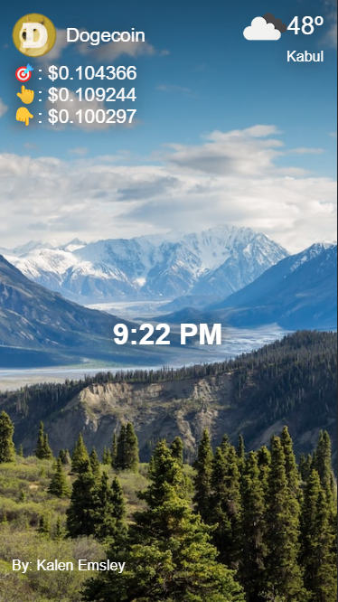
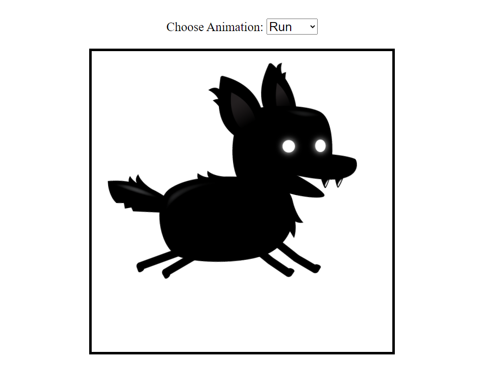

## [Personal Dashboard](https://github.com/habibullahturkmen/javascript-projects/tree/main/personal-dashboard)

  

## [Color Scheme Generator](https://github.com/habibullahturkmen/javascript-projects/tree/main/color-scheme-generator)

## [BlogSpace](https://github.com/habibullahturkmen/javascript-projects/tree/main/blog-space)

  

## [Role Playing Game](https://github.com/habibullahturkmen/javascript-projects/tree/main/role-playing-game)

## [Twimba](https://github.com/habibullahturkmen/javascript-projects/tree/main/twimba)

  

## [Cat Meme Picker](https://github.com/habibullahturkmen/javascript-projects/tree/main/cat-meme-picker)

## [Sprite Animation](https://github.com/habibullahturkmen/javascript-projects/tree/main/sprite-animation)

## [My Emojis](https://github.com/habibullahturkmen/javascript-projects/tree/main/my-emojis)

  

